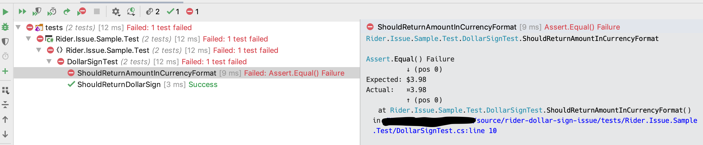

# Purpose

Small sample of an issue I've noticed in Rider.

## Issue

For some reason when using the `.ToString("C")` on a double I see results similar to the following:

```bash
bash-3.2$ dotnet test
Test run for ~/source/rider-dollar-sign-issue/tests/Rider.Issue.Sample.Test/bin/Debug/netcoreapp2.2/Rider.Issue.Sample.Test.dll(.NETCoreApp,Version=v2.2)
Microsoft (R) Test Execution Command Line Tool Version 16.3.0
Copyright (c) Microsoft Corporation.  All rights reserved.

Starting test execution, please wait...

A total of 1 test files matched the specified pattern.
                                                                                                                                                                              [xUnit.net 00:00:00.67]     Rider.Issue.Sample.Test.DollarSignTest.ShouldReturnDollarSign [FAIL]
                                                                                                                                                                                X Rider.Issue.Sample.Test.DollarSignTest.ShouldReturnDollarSign [12ms]
  Error Message:
   Assert.Equal() Failure
          ↓ (pos 0)
Expected: $3.98
Actual:   ¤3.98
          ↑ (pos 0)
  Stack Trace:
     at Rider.Issue.Sample.Test.DollarSignTest.ShouldReturnDollarSign() in /Users/bryce.a.klinker/source/rider-dollar-sign-issue/tests/Rider.Issue.Sample.Test/DollarSignTest.cs:line 10
                                                                                                                                                                              
Test Run Failed.
Total tests: 1
     Failed: 1
 Total time: 1.6047 Seconds

```

This happens on both the terminal in Rider and when using the UI. However, running `dotnet test` 
from `zsh` or `bash` outside of Rider results in the following:

```bash
bash-3.2$ dotnet test
Test run for ~/source/rider-dollar-sign-issue/tests/Rider.Issue.Sample.Test/bin/Debug/netcoreapp2.2/Rider.Issue.Sample.Test.dll(.NETCoreApp,Version=v2.2)
Microsoft (R) Test Execution Command Line Tool Version 16.3.0
Copyright (c) Microsoft Corporation.  All rights reserved.

Starting test execution, please wait...

A total of 1 test files matched the specified pattern.

Test Run Successful.
Total tests: 1
     Passed: 1
 Total time: 1.8131 Seconds
```

## Rider UI

